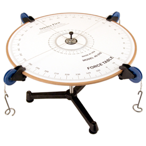

## LAB 1 C-group

Partners' Names:\_\_\_\_\_\_\_\_\_\_\_\_\_\_\_\_\_\_\_\_\_\_

\_\_\_\_\_\_\_\_\_\_\_\_\_\_\_\_\_\_\_\_\_\_\_\_\_\_\_\_\_\_\_

\_\_\_\_\_\_\_\_\_\_\_\_\_\_\_\_\_\_\_\_\_\_\_

*Your job is to determine what force will counterbalance the following
three forces (units are Newtons, or N):*

- 300 N at 0 degrees

- 200 N at 130 degrees

- 500 N at 210 degrees 

1. Calculate below the components of each of the three vectors.

2.  Calculate the vector addition of the three vectors.

3. Determine the counterbalance force (the force added to the three to sum
up to zero), both in components, and magnitude-direction.
