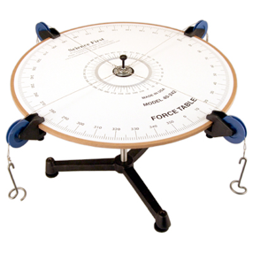

# Lab 01: Vectors

The purpose of this lab is set up a physical situation (balanced forces) in
the lab, create a model of it on the computer, and compare the two.

+ In lab you will start by working on the questions in the "C" level on paper.
+ After that you complete that you will do the work described in the "B" level:
    + Set up a "force table" with 4 balanced forces.
    + Model that on vpython
+ The starting program for this week is [lab01-add-vectors.py](http://www.glowscript.org/#/user/mwcraig/folder/phys-200-fall-2017-starting/program/lab01-add-avectors.py)
+ Ideas for an A level lab are in the lab document.
+ A helpful video about working with vectors in VPython  is here: How to "draw" vectors in VPython (https://youtu.be/nhg6HTDKk6w)
+ Pre-lab quiz:
    + Use this vector simulator: [PHET vector Addition simulation](https://phet.colorado.edu/en/simulation/vector-addition)
    + Answer the questions: [Pre-lab Quiz 1](https://mnstate.learn.minnstate.edu/d2l/common/dialogs/quickLink/quickLink.d2l?ou=4317308&type=quiz&rcode=MNSCU_LOCA-14866446)

\eject

## LAB 1 C-group

Partners' Names:\_\_\_\_\_\_\_\_\_\_\_\_\_\_\_\_\_\_\_\_\_\_

\_\_\_\_\_\_\_\_\_\_\_\_\_\_\_\_\_\_\_\_\_\_\_\_\_\_\_\_\_\_\_

\_\_\_\_\_\_\_\_\_\_\_\_\_\_\_\_\_\_\_\_\_\_\_

*Your job is to determine what force will counterbalance the following
three forces (units are Newtons, or N):*

- 300 N at 0 degrees

- 200 N at 130 degrees

- 500 N at 210 degrees

1. Calculate the components of each of the three vectors. Show your work below. \vspace{2in}

2.  Calculate the vector addition of the three vectors. Show your work below. \vspace{1in}

3. Determine the counterbalance force (the force that needs to be added to the three to sum up to zero), both in components, and magnitude-direction. Show your work below.

\eject

## LAB 1B: Modeling with Vectors

### OBJECTIVES

+ Learn how to perform vector math operations , both in VPython and
 manually
+ Learn how to compare experimental results to expected results

### *Statement of the problem*

Your job is to determine what force will
counterbalance the following three forces using *both* of the methods below.

- *300 N at 0$^\circ$*
- *200 N at 130$^\circ$*
- *500 N at 210$^\circ$*

**Method 1:**

- Place the three forces and your solution force on the force table
  provided.

- See how valid your solution is, by changing the angles and weights
  slightly. How much do these need to change to make the ring fall
  off-center?

**Method 2:**

- Start with the VPython script add\_vectors available on glowscript
  (link on D2L).

- Run the code and debug it so that the counterbalance force is both
  calculated and visualized. The two forces in this version are NOT
  ones in the problem you are solving!

- Modify the script to find the counterbalance force of the 3 forces
  in the lab problem, both numerically and graphically.

- Compare the VPython counterbalance solution to the Method 1
  solution. Note also how the two methods give very different
  visualizations of the counterbalance force...same force, different
  interpretations.

- State whether the two solutions are in agreement. To
  do so, you need to know how accurate the force table solution is.
  Try changing the weights on the string and the angle of the
  solution, and see how far off these can be for the ring to stay
  balanced! This test will give you a range of values for magnitude
  and angle in your solution.

**Turn into Lab 01 B-level assignment area: A WORD document that includes:**

- Neat sketch showing each of the four vectors (the three given ones and the fourth one that balances them), what you coordinate system you used (which way was x? y?) and the component form of each of the vectors in the coordinate system you chose.
- Evaluation of the accuracy of the force table solution
- A clear statement about whether the two methods agree, and
  evidence.
- The link to your graphical addition glowscript program
- Short paragraph stating obstacles to completing the lab.
- Who you worked with and what each person contributed.

\eject

## A-level Ideas

If you choose to submit an A-level part of the lab please be sure to submit it to the Lab 01 A-level area in D2L. The word document you submit should include a brief explanation of what you are doing in the label, how you did it, and what you found. You must submit a B-level in order to submit an A-level.

- Try algebraic and graphical addition of more than three vectors.
- Try changing one of the given vectors and verify the results of the program.
- Try subtracting a vector from another graphically and algebraically:  verify results.
- Propose your own idea.
