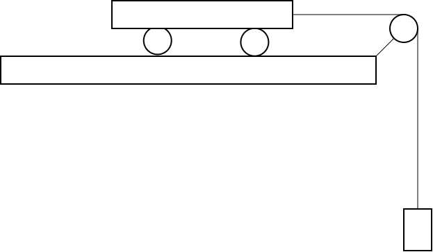

# Lab 2 Force and Momentum

# C-level questions

# Part 1 of 2

You and a group of friends are in a heated debate brought on by a discussion
of loading a friend’s truck with too much mass.  According to the truck
company, the truck always provides the same amount of force (in the form of
torque from the engine) in the same amount of time. Two of the students in the
group are taking physics.

Liz argues that the truck does not need to exert more force to start moving
when fully loaded, compared to empty.  She says that force is the same as
momentum change over time, and she says the same force always creates the same
momentum change in the same time.

Peter says that can’t be right.  He has been taking physics too, and knows
that it is harder to get a more massive object moving as fast as a less
massive object if you apply the same force, so the truck will have to exert
more force to get the fully loaded truck moving at the same speed as the
unloaded truck.

On the axes below, sketch the result of applying the same force for the same
amount of time. After doing that, answer the questions about this situation
below the sketch. Feel free to use the simulator from the pre-lab to help make
the sketch.

\hspace{2in}


\eject

### Answer these questions about the graphs you sketched:

+ What is correct about what Liz said? What, if anything, is incorrect? Explain. \vspace{1in}
+ What is correct about what Peter said? What, if anything, is incorrect? Explain.\vspace{1in}

In the B-level part of the lab, you will use a cart, track and pulley to model the situation on the first page.

{ width=2in }


### Answer this question about the B-level experiment

+ To model the situation of the unloaded truck vs the loaded truck, which mass should you change in the B-level experiment, the mass on the cart or the hanging mass? Explain.


\eject

# Part 2 of 2

Later in the lab you will model to motion of a moving cart. Please *read* the
code below (do not type it in to glowscript) and answer the questions below the
code.

``` {#mycode .python .numberLines}
from vpython import *

track = box(pos=vector(0, -1, 0),
            size=vector(10, 1, 0.5),
            color=color.red,
            opacity=0.4)

cart = box(pos=vector(-5, 0, 0),
           radius=0.3,
           color=color.cyan,
           make_trail=True)

v = vector(0.5, 0, 0.5)
cart.mass = 0.5
cart.momentum = cart.mass * v
force = vector(0.1, 0, 0)
delta_t = 0.05
t = 0
while t <= 20:
    rate(100)
    cart.momentum = cart.momentum + force * delta_t
    v = cart.momentum / cart.mass
    cart.pos = cart.pos + v * delta_t
    t = t + delta_t
print(v)

```

Questions

1.  What physical items are represented in the code?
2.  What is the initial velocity of the cart? Answer as a vector.
3.  Is the cart located above the track or below it? Remember that the y-axis points towards the top of the screen.
4.  In which line of code is the position of the cart updated?
5.  What is the value of the time step, $\Delta t$?
6.  The program simulates the motion of the system for how many seconds?
7.  What is the force applied to the cart?
8.  Which line updates the cart's momentum?
