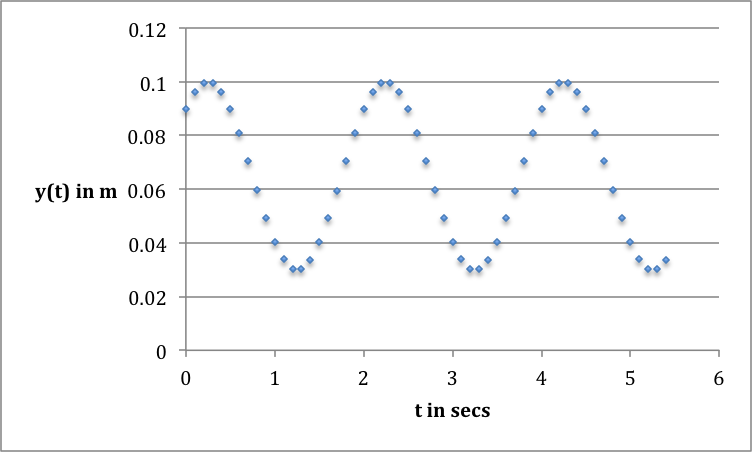

# Lab 06: Spring motion and spring constants
## C-level group questions

Group Names: \_\_\_\_\_\_\_\_\_\_\_\_\_\_\_\_\_\_\_\_\_\_
\_\_\_\_\_\_\_\_\_\_\_\_\_\_\_\_\_\_\_\_\_\_\_\_\_\_

### READING:

+ 4.11 Analytical solution: spring mass system (pg. 148, M&I 4th ed.)
+ 4.17 General solution for the mass spring system (pg. 161, M&I, 4th ed.).

## Part 1: Interpreting graphs of sinusoidal functions

You are going to try to fit the oscillating function to a curve given by
the following mathematical relationship:

$$
y(t)=A \sin(B\*t + C) +D
$$

Notice that there are 4 constants in this function. You will be asked how each
affects the shape of the function.

*HINT*: Look at the glowscript program in D2L to understand how changing
each of the parameters below affects the curve.

1. How would changing the value of A for the curve in the graph change the
curve? Explain. \vspace{0.5in}
1. How would changing the value of B for the curve in the graph change the
curve? Explain.  \vspace{0.5in}
1. What is the value of B for the curve in the graph? Explain.  \vspace{0.5in}
1. How would changing the value of C for the curve in the graph change the
curve? Explain.  \vspace{0.5in}
1. How would changing the value of D for the curve in the graph change the
curve? Explain. \vspace{0.5in}

## Part 2: Expected force-displacement graph

In the B-level you will suspend a mass on a spring over a motion
detector and measure the displacement of the mass and the force on the
spring as a function of time.

Look at the sample data for the B-level in D2L and answer these
questions:

1. Why is the slope of the force-position graph negative?  \vspace{0.5in}
1. How would you get the spring constant from the force-position graph?  \vspace{0.5in}
1. Which parameter in the fit to the position-time graph is the angular
frequency?  \vspace{0.5in}
