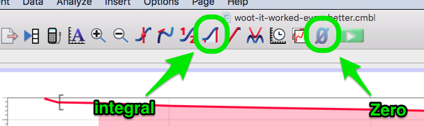

# Lab 08: Conservation of energy

## B-level experiment

### Objectives

-   Explore energy conservation in an experimental setting.
-   Relate work to change in kinetic energy
-   Relate work to potential energy

### Some LoggerPro buttons...

{ height=0.5in }

### Important setup steps

- Measure the mass of the cart and the force probe separately (they are too large to measure together) before you start.
- Be sure to use **two red springs** to pull the cart.
- Change the data collection setup by going to `Experiment → Data Collection...` and set
    - Set `Duration` to `0.5` sec.
    - Set `Sampling Rate` to `100` samples/sec.
- Attach a bumper between the cart and end of track to prevent the cart from slamming into the post you have attached the spring to.
- Zero the *force probe only* with no weight or spring attached and with the force probe mounted on the cart. See the diagram above for the location of the zero button.
- When you collect data do not release the cart until you hear the motion detector start to click.

### Experiment and questions to answer

- Start the cart near, but at least 10cm from, the motion detector so that the springs are stretched. Release the cart once you hear the motion detector clicking.
- You only need one run of good data; see D2L for an example of what position, velocity and force vs time should look like.
- Change the top plot to be force on the vertical axis and position on the horizontal axis.
- Add a new calculated column for kinetic energy
    - Go to `Data → New Calculated Column...`
    - Give the new column a sensible name, like "Kinetic Energy"
    - Set the short name to something sensible like "KE"
    - Change the units to "J" (for Joule)
    - For the formula, use the kinetic energy formula.
        - You will need to type in a number in place of the mass.
        - To get the velocity, click on `Variables (Columns)` and select `Velocity`.
        - In LoggerPro you square values using `^2` (that is different than in Python)
        - As an example, your kinetic energy formula should look like this: `0.5 * 0.6xx * "Velocity"^2` *except* you should replace `0.6xx` with the mass of your cart/probe in kg.
- Change the middle graph to show kinetic energy vs time.
- Delete the bottom graph so you only have two graphs.
- Add a new calculated column for elastic potential energy. Look back at the C-level for the expression you came up with that relates the stretch of the spring to the distance measured by LoggerPro.
    - The LoggerPro column for distance is....`Distance`!
    - Call this column something sensible (same for the short name) and use unit "J" for Joule.
- Also display the elastic potential energy in the kinetic energy vs time graph.
- Add a calculated column for total energy, and add the graph of total energy to the kinetic energy vs time graph.

#### Questions

- Select the "good" part of the force-position graph and use the integral tool to calculate the work done by the spring.
- Compare the work done by the spring to the change in kinetic energy of the cart. Include *numbers* in your comparison, and comment on whether it matches what you expected in the C-level.
- Compare the work done by the spring to the change in elastic potential energy. Include *numbers* in your comparison, and comment on whether it matches what you expected in the C-level.
- Is total energy conserved for the system of cart and spring? Explain your answer based on your data.
- Include screen shots of each graph (force-position and energy-time) in your lab write-up.
