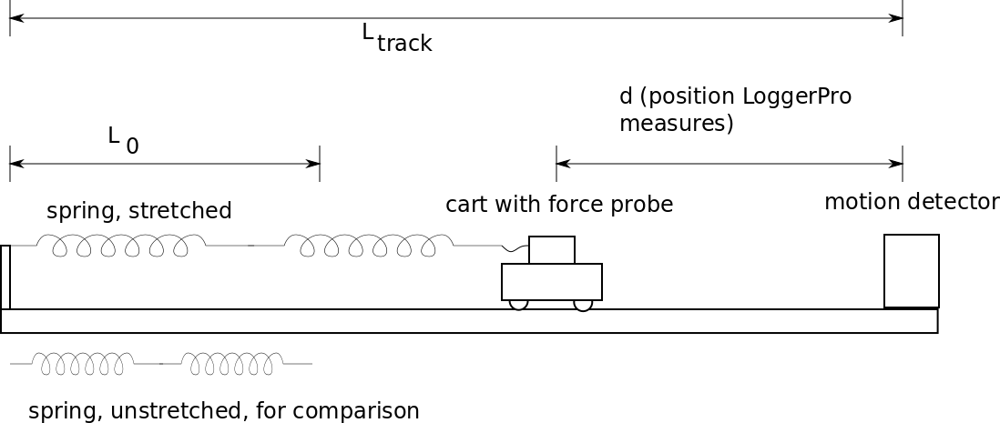
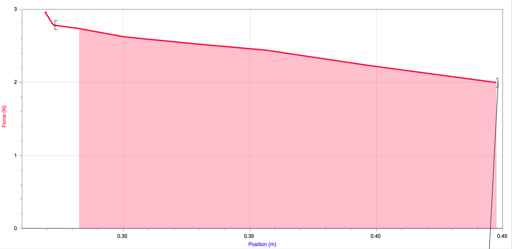

# Lab 08: Conservation of energy

## C-level Group Questions

Group Names: \_\_\_\_\_\_\_\_\_\_\_\_\_\_\_\_\_\_\_\_\_\_
\_\_\_\_\_\_\_\_\_\_\_\_\_\_\_\_\_\_\_\_\_\_\_\_\_\_

In the lab today you will set up a cart on a track as shown below. Several distances are labeled; you will measure $L_{\text{track}}$ and $L_0$ and LoggerPro will measure the distance $d$. Note that two springs are used end-to-end.

Answer the questions below about this setup.

1. If each of the two springs has spring stiffness 10 N/m, what is the stiffness
   of the two springs end-to-end? Explain. \vspace{1in}
2. The elastic (spring) potential energy is $\frac{1}{2}k_ss^2$, where $s$ is
the amount by which the spring is stretched. How is $s$ related to the other
distances on the diagram, $L_{\text{track}}$, $L_0$ and $d$? Explain.
\vspace{1in}
3. The graph below shows the force as measured by the force probe as a
function of the position $d$ measured by the motion detector. The work done is
$\int \vec{F}\cdot d\vec{r}$. One way to think about that integral is as the
area under the curve, shaded below. Calculate that area (hint: area of a
triangle plus rectangle).
 \vspace{0.5in}
4. What should the change in kinetic energy of the cart be as it moves from
$d\approx 0.28$m to $d\approx 0.45$m? *Hint*: This should require no new
calculation.\vspace{0.5in}
4. What should the change in elastic potential energy be as the cart moves
from $d\approx 0.28$m to $d\approx 0.45$m? *Hint*: This should require
(almost) no new calculation.\vspace{0.5in}
