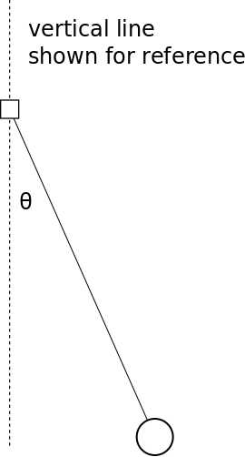
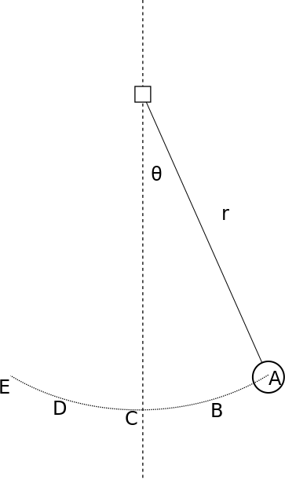

# Lab 10: Rotational motion

## C-level Group Questions

Group Names: \_\_\_\_\_\_\_\_\_\_\_\_\_\_\_\_\_\_\_\_\_\_ \\
\_\_\_\_\_\_\_\_\_\_\_\_\_\_\_\_\_\_\_\_\_\_\_\_\_\_

### A. Forces, torques and angular momentum

In this lab you will connect a mass, the ball in the diagram below, to a
rotary motion sensor, the box in the diagram below, using a light, stiff rod.
The rotary motion sensor will measure the angle $\theta$ the mass relative to
vertical.

{ height=2in }

It is easiest to analyze this motion using the *angular momentum principle*.
From the book, the angular momentum principle is

$$\vec{L}_f = \vec{L}_i + \vec{\tau}_{net} \Delta t,$$

where the angular momentum, $\vec{L}$, is related to the regular momentum
$\vec{p}$ by $\vec{L} = \vec{r} \times \vec{p}$, and the *torque*,
$\vec{\tau}$ is related to the net force by $\tau = \vec{r} \times
\vec{F}_{net}$.

1. Draw a free body/force diagram showing all of the forces acting on the ball
at the moment shown in the picture above.

2. For each force say whether the torque due to that force is zero or not
zero. Note that the vector $\vec{r}$ points from the "pivot point" (the rotary
motion sensor in this case) to the mass. You may find the cross-product
program from the pre-lab helpful.

3. In the usual coordinate system ($x$ to right, $y$ towards the top of the
page, $z$ coming out of the page), what are the components of the torque at
the moment shown if $\theta=30^\circ$, $r=0.2$m, and the mass of the ball is
$m=0.1$kg? *Use the glowscript cross-product calculator for this; you need to
calculate the magnitude of the two vectors $\vec{r}$ and $\vec{F}$. Only
include the force(s) for which the torque is not zero.*

### Energy of the system

Assume that you know the starting angle of the mass and the distance $r$. Once
the ball is released, it moves along the dotted path in the image below.

{ height=1.5in }

4. What kinds of energy does the system of ball and Earth have?

6. Write down an expression (formula) for the total energy of the ball/Earth
system. Assume the origin is at the top of the rod.

6. What is the energy of the ball/Earth system when the ball is released from
rest at point A? Your answer should be in terms of $r$, $g$, $m$ and sine or
cosine of $\theta$.

7. Find the velocity of the ball at point C using conservation of energy. Your
answer should be in terms of the same variables as in the previous question.

The simulation and the rotary motion sensor will measure angular speed, called
$\omega$, which is the rate of change of $\theta$. It turns out that in this
setup, you can calculate the angular speed from the "regular" speed with the
equation $\omega = v/r$.

8. What is the angular velocity at the point C?

9. At which point or points along the motion will the angular velocity be
zero? At which point or points will it be largest?

FYI, the kinetic energy can be written in terms of the angular velocity also:

$$
K = \frac{1}{2} m v^2 = \frac{1}{2} m r^2 \omega^2.
$$

